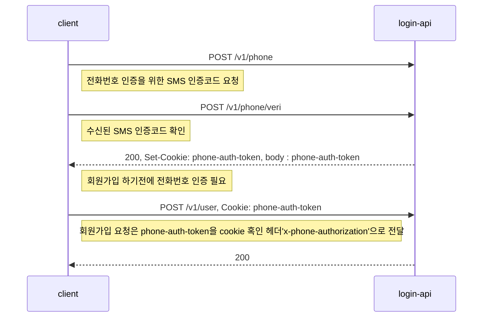
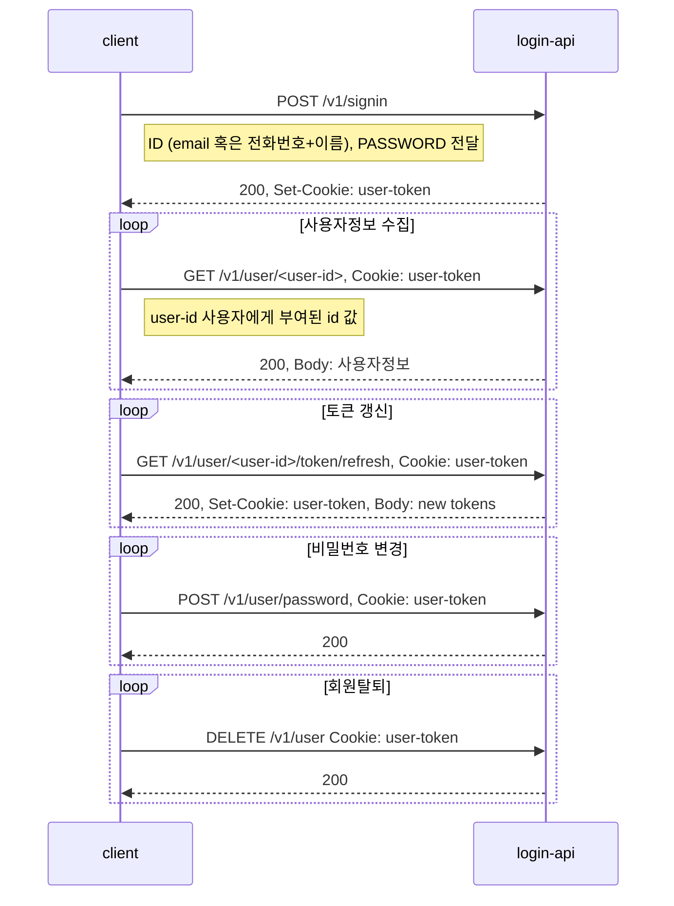
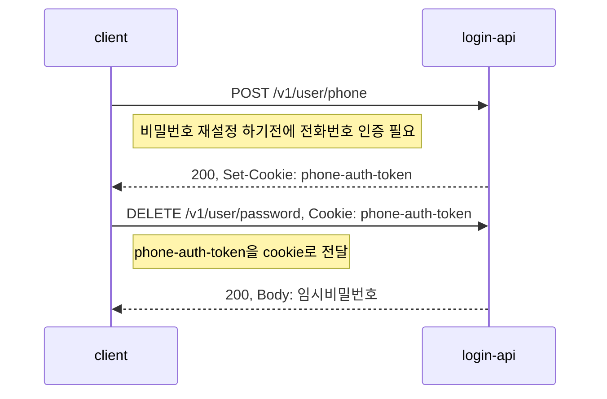

# login-api

## Requirement

1. node ^16.15.1
2. npm >= 6.0.0
-----------------
## 로컬 설치/실행 방법

```console
npm install
npm start
```
## Docker build / run

```console
// 1. Docker build
./docker-build.sh 
혹은
docker build . -t ably/login-api-server:1.0.0

// 2. Docker run
./docker-run.sh
혹은
docker run -dp 8080:80 --name login-server ably/login-api-server:1.0.0
```
-----------------
## API 구현 명세
|기능|method|URL|설명|
|------|----|---|---|
|전화번호 인증 요청|POST|/v1/phone|사용자의 전화번호를 인증하기 위한 인증코드 발송|
|전화번호 인증 |POST|/v1/phone/veri|사용자의 전화번호를 인증하기 위한 인증코드 확인|
|회원 가입|POST|/v1/user|전화번호를 인증 후 회원 생성 기능|
|로그인|POST|/v1/signin|사용자 로그인(이메일+비밀번호 혹은 전화번호+이름+비밀번호)|
|회원 정보 조회|GET|/v1/user|로그인 한 사용자의 정보를 조회할 수 있는 기능|
|토큰 갱신|POST|/v1/user/'user-id'/token/refresh|로그인 한 사용자의 토큰 갱신 기능|
|비밀번호 재설정|DELETE|/v1/user/password|전화번호를 인증 한 사용자 삭제 기능|
|비밀번호 변경|POST|/v1/user/password|로그인한 사용자의 비밀번호 변경 기능|
|회원 탈퇴|DELETE|/v1/user|로그인 한 사용자 삭제 기능|
-----------------
## 회원가입 절차


## 로그인, 사용자정보 수집, 토큰 갱신, 비밀번호 변경, 회원탈퇴  절차


## 비밀번호 재설정


-----------------
## REST-API 사용 설명
>### 전화번호 인증 요청
>#### Request
> ```console
>POST /v1/phone HTTP/1.1
>Content-Type: application/json
>{
>    "phone": "010-1233-1233",
>    "name": "아무개"
>}
>```
>#### Response
> ```console
> body
>{
>}
>```
>### 전화번호 인증코드 확인
>#### Request
> ```console
>POST /v1/phone/veri HTTP/1.1
>Content-Type: application/json
>{
>    "phone": "010-1233-1233",
>    "name": "아무개",
>    "code": "xxxxxxx"
>}
>```
>#### Response
> ```console
> Set-Cookie: phone-auth-token=<token>; Path=/; HttpOnly; Expires=Fri, 01 Jul 2022 21:24:13 GMT;
> 
> body
>{
>    "phone-auth-token": <phone-auth-token>
>}
>```

> ----------
>### 회원가입
>#### Request
> ```console
>POST /v1/user HTTP/1.1
>Cookie: phone-auth-token=<token>
>Content-Type: application/json
>{
>    "email": "advdf@hamel.com",
>    "password": "interpark1!",
>    "checkPassword": "interpark1!",
>    "nickname": "ddkdkdkd"
>}
>```
>#### Response
> ```console
> body
>{
>   "userId": <user id>
>}
>```
> ----------
>### 로그인
>#### Request
> ```console
>POST /v1/signin HTTP/1.1
>Content-Type: application/json
>{
>    "email": "advdf@hamel.com",
>    // or
>    //"phone": "010-1233-1233",
>    //"username": "허동욱",
>    "password": "interpark1!"
>}
>```
>#### Response
> ```console
> Set-Cookie: user-token=<token>; Path=/; HttpOnly; Expires=Fri, 01 Jul 2022 21:24:13 GMT;
> 
> body
>{
>    "access_token": <access_token>,
>    "refresh_token": <refresh_token>
>}
>```
> ----------
>### 회원정보 조회
>#### Request
> ```console
>GET /v1/user/<user-id> HTTP/1.1
>Cookie: user-token=<token>
>Content-Type: application/json
>```
>#### Response
> ```console
> body
>{
>    "email": "advdf@hamel.com",
>    "username": "허동욱",
>    "nickname": "ddkdkdkd",
>    "phone": "010-1233-1233"
>}
>```
> ----------
>### 토큰 리프레쉬
>#### Request
> ```console
>GET /v1/user/<user-id>/token/refresh HTTP/1.1
>Cookie: user-token=<token>
>Content-Type: application/json
>```
>#### Response
> ```console
> Set-Cookie: user-token=<new_token>; Path=/; HttpOnly; Expires=Fri, 01 Jul 2022 21:24:13 GMT;
> body
>{
>    "access_token": "<new_access_token>",
>    "refresh_token": "<new_refresh_token>"
>}
>```
> ----------
>### 비밀번호 재설정
>#### Request
> ```console
>DELETE /v1/user/password HTTP/1.1
>Cookie: phone-auth-token=<token>
>```
>#### Response
> ```console
> body
>{
>    "tmp_password": "TejZ0WbhMD49zwNx"
>}
>```
> ----------
>### 비밀번호 변경
>#### Request
> ```console
>POST /v1/user/password HTTP/1.1
>Cookie: user-token=<token>
>{
>    "password": "interpark1!",
>    "checkPassword": "interpark1!"
>}
>```
>#### Response
> ```console
=======
> Set-Cookie: user-token=<token>; Path=/; HttpOnly; Expires=Fri, 01 Jul 2022 21:24:13 GMT;
> body
>{}
>```
> ----------
>### 회원탈퇴 
>#### Request
> ```console
>DELETE /v1/user HTTP/1.1
>Cookie: user-token=<token>
>```
>#### Response
> ```console
> Set-Cookie: user-token=''; Path=/; HttpOnly; Expires=0;
> body
>{}
>```
> ----------
